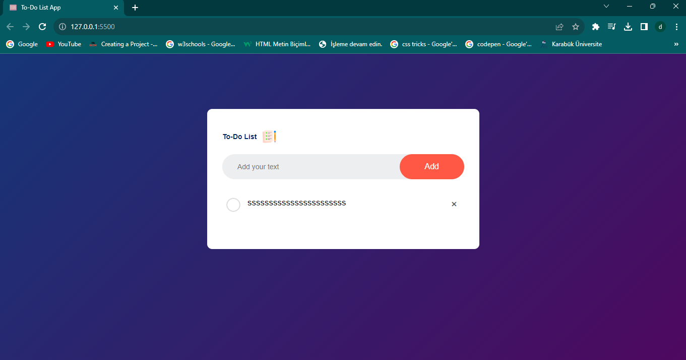
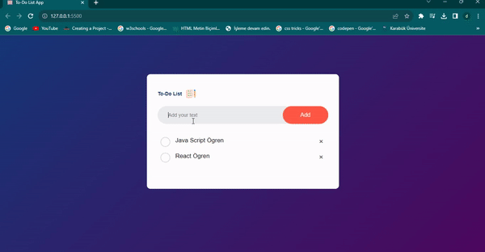

# To-DoListApp
HTML-CSS-JAVASCRİPT

# To-DoListApp
🚀 Yeni Proje Lansmanı: Yapılacaklar listesi uygulaması!
💻 Bugün sizlerle heyecan verici bir projeyi paylaşmak istiyorum. HTML, CSS, JavaScript kullanarak geliştirdiğim "Yapılacaklar listesi" uygulamasını tamamladım!
🌐🔍 Bu projenin amacı, Birden fazla yapmak istediginiz iş, aktivite, spor vb şeyleri listeleyerek yapmanızı kolaylaştırır.
Öne Çıkan Özellikler: 💻 Search kısmına yazarak eklediginiz şeyleri silmediginiz sürece durur ve gözükür. Yapıldıgını göstermek için üzerine tıklamanız yeterli.
Eğer projem hakkında daha fazla bilgi almak, görüşlerinizi paylaşmak veya gelecekteki projelerim hakkında konuşmak isterseniz, lütfen durmusozgul66@gmail.com benimle iletişime geçin. Kişisel projelerim benim için önemlidir, umarım bu uygulama da size fayda sağlar!
🌟🚀 #WebDevelopment #To-Do List #Frontend #Projelerim 

